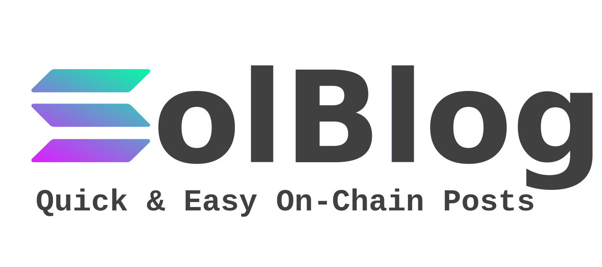
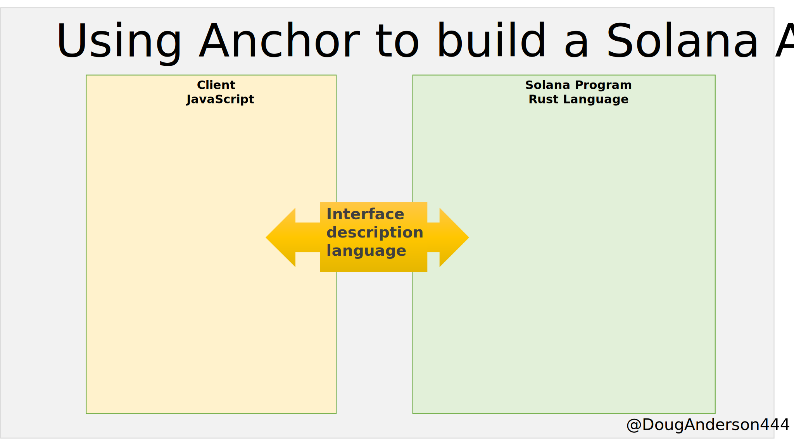
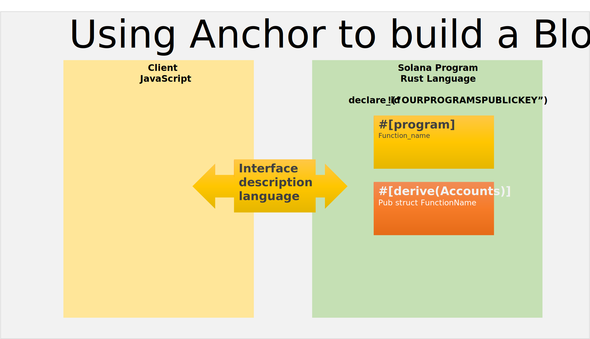
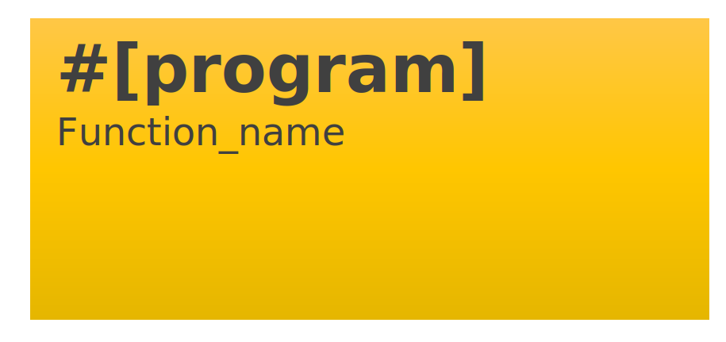
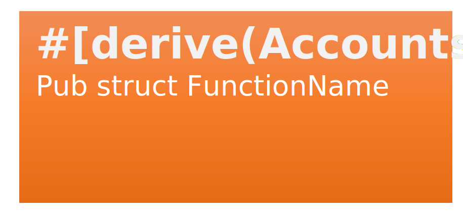
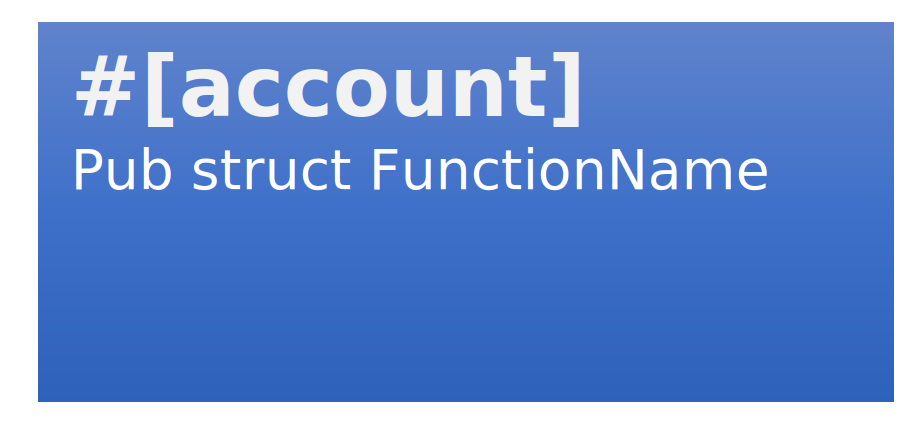
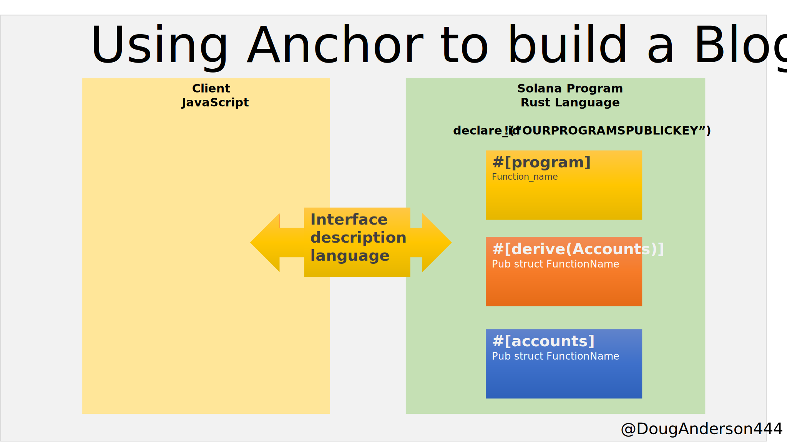
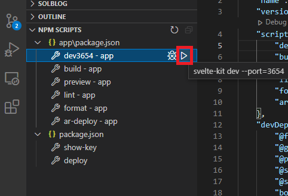

A simple blog platform, powered by Solana with a SvelteKit front end.

-   Solana (Rust)
-   Anchor (Rust macros + IDL generation)
-   Svelte & SvelteKit (JavaScript front end)

YouTube video on building the Rust portion:

<a href='https://youtu.be/w-n87Aq3f8k' target='_blank'>

</a>

# Introduction

In this tutotial, we will create a simple short form yet fully functional blog with the data saved on Solana. We are going to do this using the Anchor framework to illustrate how to use Anchor.

We're building a blog publishing platform because it is a simple web format that most people are familiar with. Blogs have a simple data structure: A blogger and their blog posts. This example of storing data on the Solana network is an easy way to learn.

We will cover in this tutorial Anchor setup and Anchor program building, and touch on the JavaScript front end and how it interacts with the Anchor program.

# What Anchor does for you

Building Solana programs in Rust language can be tough. Anytime you want to save or retrieve data from an account, you need to think about packing/unpacking the data, serializing/unserializing the data and formats, which are all a real pain.

Anchor abstracts away from the low level construction of accounts, the packing and unpacking, and modifying the interfaces to your Solana program. It does this by bundling the boilerplate into rust macros! This gives users of Anchor a lot of shortcuts and speed to building Solana programs.

There are always two parts to a Solana app -- the _on-chain_ program and accounts, and the _off-chain_ app that interacts with it. The other benefit Anchor brings is the alignments of the interaction between these two app segments. This alignment is called an Interface Description Language [(IDL)](https://en.wikipedia.org/wiki/Interface_description_language). Since the interface of the off-chain app (say, in JavaScript) must always match the on-chain Solana program, this is a really nice convenience feature to have.

<div style="background-color: white;"></div>



# Prerequisites

Prior knowledge:

-   Complete Solana 101 Pathway
-   Basic understanding of Rust & Solana will be a plus.
-   Basic JavaScript knowledge
-   Basic Command Line Interface usage

# Technical Requirements

We will use these installed tools throughout the tutorial:

-   A Linux command line interface
-   Anchor and Rust installed in accordance with the Setup section below
-   Phantom.app Solana Wallet, with an address you are comfortable using on DevNet (can make a new address in Phantom if you like)

## Anchor Versions

It's important to understand that Anchor is new, and the API may change as development proceeds. These directions are valid now, but might differ in the future if/when there are breaking changes. But the general overall concepts remain unchanged.

I used v 0.16.1 for this tutorial.

```text
anchor --version
anchor-cli 0.16.1
```

# Setup

Getting started with Anchor is fairly straightforward, and you can follow the [setup instructions on the Anchor website](https://project-serum.github.io/anchor/getting-started/installation.html).

For test environments, you have the choice of [installing a local validator](https://docs.solana.com/developing/test-validator) or using the [Devnet online](https://explorer.solana.com/?cluster=devnet). We will be deploying to the Solana Devnet to practice deploying in real life. As the saying goes, _"deploy early, deploy often"_! The last thing you want is for your code to work in a development environment, and not in production.

Once you have installed all the Anchor dependencies, it's time to initiate a project!

## Init an Anchor Project

Initiating a project is pretty straightforward. In the command line -- use Windows Subsystem for Linux 2 (WSL2) if you are on Windows, as the Berkeley Packet Filter (BPF) compiler portion of the Solana toolchain doesn't work in regular Windows.

Don't make a new folder! Anchor will create a new one for you :)

```text
anchor init solblog
```

This creates a folder and puts the anchor starter in that directory. From here, we can build our app.

## Project folders

The folders we are interested in the most to start are:

```text
|
├── programs
|   └── solblog
|        └── src
|             └── lib.rs
```

By default, Anchor has put some basic starting code in there for us.

```rust
// programs\solblog\src\lib.rs

use anchor_lang::prelude::*;

declare_id!("Fg6PaFpoGXkYsidMpWTK6W2BeZ7FEfcYkg476zPFsLnS");

#[program]
pub mod solblog {
    use super::*;
    pub fn initialize(ctx: Context<Initialize>) -> ProgramResult {
        Ok(())
    }
}

#[derive(Accounts)]
pub struct Initialize {}
```

Let's break down what we see.


After including the anchor library, the program public key has this placeholder:

```rust
declare_id!("Fg6PaFpoGXkYsidMpWTK6W2BeZ7FEfcYkg476zPFsLnS");
```

That default key is NOT our public key for _your_ build. You need to generate that for your program. We generate it once, and then include it, and can make as many changes as we need to before deploying.

Since that's not our key, let's fix that now and generate our key.

Run:

```text
cd solblog
anchor build
```

As that builds (it'll take a minute), watch your target folder as it is pretty empty right now.

```text
|
├── programs
|   └── solblog
|      └── src
|         └── lib.rs
├── target
|   └── rls
```

Watch how the target folder changes once build completes it is a bit beefier:

```text
|
├── programs
|   └── solblog
|      └── src
|         └── lib.rs
├── target
|   └── idl
|   └── deploy
|           solblog.so
|           solblog-keypair.json
```

Our newly generated code public key is in that new `./target/deploy` folder, go ahead and check it out!

To show our program public key which we will use as our id, simply run:

```text
solana address -k ./target/deploy/solblog-keypair.json
```

Which shows us our unique key:

```text
BLoG9PtBTkhUbGRAYVe8jzd5ji1G2VPkzwbsRV3bnteD
```

Your key will look different, that's ok. Anchor will generate a unique keypair for everyone, which is how we can uniquely identify our programs from one another.

If you're following along in this tutorial repo, I've placed a shortcut to this script in the `package.json` file, so you can simply run `npm run show-key` in the terminal (as long as it's WSL2/Linux -- the rust toolchain doen't work in Windows).

Copy-and-paste your key and replace that default `declare_id` placeholder:

```rust
declare_id!("SoMeKeyThatIsUniqueTOmyPROGRAM");
```

We will also need to include this same Program ID in the client side, in our `app\src\lib\anchorClient.js`

```js
// app\src\lib\anchorClient.js

// programId is the program public key, SoMeKeyThatIsUniqueTOmyPROGRAM
const program = new anchor.Program(idl, programId, provider)
```

We will get to that part once we build the client side. My only point at this time is to emphasize that the client side in javascript must match the Program side in Rust. For now, let's finish taking a look at the Rust code.



The next code block under `#[program]` is our program's functions, how we make the program do anything. The function names here are lowercase snake_case.



Notice the `#[derive(Accounts)]` struct is the same name as in the `program`, but in `camelCase` (whereas `snake_case` is used in program above).

The next code block under `#[derive(Accounts)]` is a going to be struct that describes the account itself and enables us to access fields from the account struct (which is non-existant at this point). Let's create it:



```rust
#[account]
pub struct BlogAccount {
    pub authority: Pubkey,    // save the posting authority to this authority field
    pub latest_post: Vec<u8>, // <-- where the latest blog post will be stored
}
```

We created the third style code block, which is an Account struct which is a Solana account that holds our data. We will save 2 pieces of data to this account:

1. blog `authority`: you need to have this keypair in order to make posts,
2. `latest_post`: the, well, the lastest blog post.

Now we have the three Anchor blocks we need to make our blog:



But right now our program doesn't do anything, because our program methods are empty.

# Writing the Rust functions

In `initialize` we want to set our blog account `authority`. We will set `authority` to the same public key as the keys that signed the transaction.

BUT, in order for us to have access to `authority` in `initialize()` we need:

1. BlogAccount must be a created account
2. BlogAccount must paid for by someone
3. BlogAccount must have enough space allocated to store our data
4. `initialize` must have access to the `authority` field on BlogAccount
5. `authority` must sign the `initialize` tranaction request

Anchor makes this easy for us using their macros:

```rust
#[derive(Accounts)]
pub struct Initialize<'info> {
    #[account(
        init, // 1. Hey Anchor, initialize an account with these details for me
        payer = authority, // 2. See that authority Signer (pubkey) down there? They're paying for this
        space = 8 // 3.A) all accounts need 8 bytes for the account discriminator prepended to the account
        + 32 // 3.B) authority: Pubkey needs 32 bytes
        + 566 // 3.C) latest_post: post bytes could need up to 566 bytes for the memo
        // You have to do this math yourself, there's no macro for this
    )]
    pub blog_account: Account<'info, BlogAccount>, // 1. <--- initialize this account variable & add it to Context.accounts.blog_account can now be used above in our initialize function
    pub authority: Signer<'info>, // 5. <--- let's name the account that signs this transaction "authority" and make it mutable so we can set the value to it in `initialize` function above
    pub system_program: Program<'info, System>, // <--- Anchor boilerplate
}
```

The `#[account]` macros in `#[derive(Accounts)]` wire up all the connections we need in order to use `blog_account` and `authority` in our `initilize` function. So now we can use `blog_account` and `authority` in our function:

```rust
#[program]
pub mod solblog {
    use super::*;
    pub fn initialize(
        ctx: Context<Initialize>, // <-- Anchor context that holds all the account data (structs) below
    ) -> ProgramResult { // <--- These functions are snake_case of the CamelCase struct below
        let b_p_a = &mut ctx.accounts.blog_account; // grab a mutable reference to our BlogAccount struct
        b_p_a.authority = *ctx.accounts.authority.key; // set the BlogAccount.authority to the pubkey of the authority
        Ok(()) // return the Result
    }
```

---

Once Anchor has helped us `initilize` our account and set the blog `authority` now we want to actually save some data to our BlogAccount. We follow similar steps:

First we create our Anchor glue by writing an additional `#[derive(Accounts)]` struct. Again, we want access to `blog_account` so we need to include that. We are changing `latest_post` so `blog_account` needs to be mutable, hence the `#[account(mut)]` but we also need for the transaction to be signed by the blogger, so it also needs to include `authority` as a `Signer`. The result looks like this:

```rust
#[derive(Accounts)]
pub struct MakePost<'info> {
    #[account(
        mut, // we can make changes to this account
        has_one = authority)] // the authority has signed this post, allowing it to happen
    // this is here again because it holds that .latest_post field where our post is saved
    pub blog_account: Account<'info, BlogAccount>, // <-- enable this account to also be used in the make_post function
    // Also put authority here
    // has_one = authority ensure it was provided as a function arg
    // ensures the poster has the keys
    // has to come after the Account statement above
    // no mut this time, because we don't change authority when we post
    pub authority: Signer<'info>
}
```

Now that this Anchor struct has given us access to these fields, we can use them in the first code block under `#program`:

```rust
    pub fn make_post(
        ctx: Context<MakePost>,
        new_post: Vec<u8> // <--- our blog post data
    ) -> ProgramResult {
        let post = from_utf8(&new_post) // convert the array of bytes into a string slice
            .map_err(|err| {
            msg!("Invalid UTF-8, from byte {}", err.valid_up_to());
            ProgramError::InvalidInstructionData
        })?;
        msg!(post); // msg!() is a Solana macro that prints string slices to the program log, which we can grab from the transaction block data

        let b_acc = &mut ctx.accounts.blog_account;
        b_acc.latest_post = new_post; // save the latest post in the account.
        // past posts will be saved in transaction logs

        Ok(())
    }
```

Our `make_post` function gets broken down in a few steps here:

First we take our `new_post` as an argument to the function:

```rust
new_post: Vec<u8> // <--- our blog post data
```

Our blog posts are going to be Strings, but we don't know how long these strings are going to be. Yes, we could pad them to a certain size, but a String is really just an array of bytes. In Rust we can describe our array of bytes as a Rust Vector of u8 bytes (`Vec<u8>`), because UTF8 strings are basically just [an array of u8 bytes](https://doc.rust-lang.org/std/string/struct.String.html#method.from_utf8). This will make our Rust life easier as we don't have to worry about unknown lengths in Rust, plus we can easily convert UTF8 strings to u8 arrays in javascript by using [UInt8Array](https://developer.mozilla.org/en-US/docs/Web/JavaScript/Reference/Global_Objects/Uint8Array) type. So it's a `Vec<u8>`.

Next we take the `Vec<u8>` and convert it to a String slice (`&str`) with a bit of error handling included, in case we don't get valid UTF8:

```rust
let post = from_utf8(&new_post) // convert the array of bytes into a string slice
	.map_err(|err| {
	msg!("Invalid UTF-8, from byte {}", err.valid_up_to());
	ProgramError::InvalidInstructionData
})?;
```

Lastly, we print the blog post to the Program Log:

```rust
	msg!(post); // msg!() is a Solana macro that prints string slices to the program log, which we can grab from the transaction block data
```

The reason we print to the program log is: our BlogAccount only saves the latest post... so what if we want to see previous posts? We can simply pull up prevously saved logs and we'll have it. Alternatively we could create an Account for every post, but that's a lot of "costly" overhead for very little benefit, whereas asaving to the Program Log is "Transaction priced" ($0.00025) and we only need to pay for one account (which is super cheap, but why pay more?).

Lastly, we grab the `accounts` from the context (`ctx`) and pick `blog_account` as the one we're going to use (we only have one, but you could have had more) so we can also save the most recent post to the Account (`BlogAccount`):

```rust
	let b_acc = &mut ctx.accounts.blog_account;
	b_acc.latest_post = new_post; // save the latest post in the account.
```

Our Rust Solana Program is complete, written in Rust! Now that we're done, we need to build again so that the Solana build uses our most recent code:

In project root directory, run:

```text
anchor build
```

Make sure you run anchor build in your project's root folder, anchor will take care of the rest.

# Deploy to Devnet

Now that our Rust Program has been written with the help of Anchor, it's time to deploy to the Devnet.

To deploy the anchor program on devnet, a small helper script to setup some keys, fund via airdrop, then use anchor deploy to deploy to the devnet would sure be great. That's included with this tutorial!

The deploy code is saved at `./deploy.js`. Let's walk through the necessary parts to deploy to Solana using anchor.

We need 2 keypairs in order to deploy:

1. Our Program Authority keypair, and
2. Our Program Keypair

We can generate a Program Authority keypair by using the [solana-web3.js](https://solana-labs.github.io/solana-web3.js/classes/Keypair.html#generate) library:

```js
// imported by deploy.js

import { Keypair } from "@solana/web3.js"

let programAuthorityKeypair = new Keypair()
```

To deploy our code, we need cryptocurrency SOL in our newly created account. On Devnet, we can call an airdrop to fund our account.

```js
// imported by deploy.js

import { Connection, LAMPORTS_PER_SOL } from "@solana/web3.js"

this.connection = new Connection("https://api.devnet.solana.com", "confirmed")

const signature = await this.connection.requestAirdrop(
    programAuthorityKeypair.publicKey,
    LAMPORTS_PER_SOL * 5
)
await this.connection.confirmTransaction(signature)
```

I like to use the library's constant `LAMPORTS_PER_SOL` because that way you can ensure you get a full SOL or 2, just multiply by however much you need. For this deployment, we should need between 2 - 3 SOL, so let's drop 5 SOL in there just to make sure we aren't hassled with airdropping more.

Now that we have our Program Authority Account keypair created and funded, let's save it as a keyfile (json file) so that Anchor can access it from the command line:

```js
// deploy.js

// ... [snip]

const programAuthorityKeyfileName = `deploy/programauthority-keypair.json`
const programAuthorityKeypairFile = path.resolve(
    `${__dirname}${SLASH}${programAuthorityKeyfileName}`
)

// ... [snip]

fs.writeFileSync(
    programAuthorityKeypairFile,
    `[${Buffer.from(programAuthorityKeypair.secretKey.toString())}]`
)

// ... [snip]
```

The second keypair that we need is our program keypair. This was generated for you when you ran `anchor build` and is saved in `target/deploy/solblog-keypair.json`. We need to get the programId from that keypair. We _could_ just copy and paste, or we can retrieve the keys programmatically liek this:

```js
// deploy.js

// ...[snip]
const SLASH = path.sep

const programKeyfileName = `target/deploy/solblog-keypair.json`
const programKeypairFile = path.resolve(
    `${__dirname}${SLASH}${programKeyfileName}`
)

let programKeypair = readKeyfile(programKeypairFile)

let programId = programKeypair.publicKey.toString()
```

Now we have both keys that we need to deploy!

The command in Anchor to deploy is `anchor deploy` and we want to call this from our deploy script. Let's use Nodejs to spawn a sub process to call it programatically:

```js
// deploy.js

let method = ["deploy"] // we are deploying for the first time, using 'deploy'

spawn.sync(
    "anchor",
    [
        ...method, // we use a variable so we when we want to upgrade, we can use 'upgrade' instead
        "--provider.cluster", // we want to specify the node cluster
        "Devnet", // the node cluster as the Devnet
        "--provider.wallet", // we need to pass in a keyfile to pay for the deployment
        `${programAuthorityKeypairFile}`, // this is the keypair file we created just a moment ago
    ],
    { stdio: "inherit" }
)
```

If we want to update our program after the initial deployment, we can use `anchor upgrade` instead. We would need to specify what program we are upgrading, and specify the built code we want to replace it with. So we get:

```js
// deploy.js

let method = [
    "upgrade", // we use upgrade to modify the program
    "target/deploy/solblog.so", // specify where the built code is from 'anchor build'
    "--program-id", // specify the programId
    programId,
]

spawn.sync(
        "anchor",
        [
            ...method, // use spread operator to expand our array into individual elements

// ... [snip]
// ... rest is the same
```

A full functioning version of the complete code is included with this tutorial.

Now that we've built our `deploy.js` script, we can run the script using `node` or use the shortcut script in `package.json` which is convenienlty run by:

```text
npm run deploy
```

(or)

```text
node ./deploy.js
```

The deploy script creates a new keypair to pay for the deployment for you, funds it with some SOL, and deploys it to the Devnet.

Since this tutorial is about Anchor, I'll gloss over some of the finer details in that `deploy.js` script, and jump straight to the juicy Anchor points, which are:

```js
// ./deploy.js

//... [snip]

method = ["deploy"]

//... [snip]

spawn.sync(
    "anchor",
    [
        ...method,
        "--provider.cluster",
        "Devnet", // or on Figment DataHub, https://solana--devnet.datahub.figment.io/apikey/yourApiKeyHere/
        "--provider.wallet",
        `${programAuthorityKeypairFile}`,
    ],
    { stdio: "inherit" }
)
```

When choosing to deploy, you can use Solana's Devnet or choose Figment's DataHub as well for deploying the program.

To use Figment's Datahub, Go to https://datahub.figment.io -> Make an account (It's free) -> Select Solana from Protocols -> Get the API Key and endpoint on your dashboard. Now you can use the same here in this tutorial by setting the cluster to Figment's datahub!

You may want to consider Figment's endpoint, as Public endpoints, for example native Devnet, have some limitations like rate limits, latency, per day req. limit/quota etc. However, DataHub resolves all these problems and breaks barriers that devs come across while scaling their projects. I myself ran into a couple of these issues working with Devnet, so it's a valid considering for you too.

The first run through, the deploy script uses `anchor deploy`, whereas in _subsequent_ deploys with the same program, it will use `anchor upgrade` with all the required flags included for convenience:

```js
// ./deploy.js

	method = [
		"upgrade",
		"target/deploy/solblog.so", // specify the .so file
		"--program-id", // specify the program to upgrade -- you must have the authority though!
		programId,
	]

	//... [snip]

    spawn.sync(
        "anchor",
        [
            ...method,

	// ... etc, same as deploy

```

That is because on subsequent deploys, we want Anchor to upgrade our program using the same `programId` and program authority so everything except the code stays the same. This is important because we want our program address to stay the same so users don't have to change to a new address every time we upgrade our software.

At the end, the `deploy.js` script will also save your keys to the dapp-starter style .json file for easy reference. But you'll see that I have also saved the keyfiles as `.json` bytes so they can be used by Anchor commands in the command line, since we use Anchor via CLI and not programmatically.

When you run this `deploy.js` code, you can see the result is that Anchor has filled in our basic starting point with all the necessary glue to make a Solana program work, and now it's compiled ready for the blockchain as a 149kb in size file, and real life deployment would costs about 2 SOL to deploy.

```text
|
├── target
|   └── deploy
|       └── solblog.so   149kb
```

Now that the program is deployed to Solana Devnet, we can access it from the client code inside our Svelte App, and start blogging.

Let's build the client front end to interface with our program!

# Client Setup

Anchor is every bit about the client side as it is about the program side. Our program is complete and our IDL is built, so all that is left is for us to build a front end to use it all.

Although I have chosen to use Svelte for this, any front end can be used. We will put our anchor client code in a file named `anchorClient.js` which can be used by any framework or pure vanilla JS.

So I'll get straight to the `anchorClient.js` setup and then cover the SvelteKit integration for those who wish to stick around for that part.

# Building our anchorClient

We have our IDL.json which describes how we use our app, but we need to build some handlers to call the remote procedure calls (RPCs).

Let's take a look at the `initialize()` function, now from the client side.

In order to call our initialize function in our program, we first need an equivalent fuction in javascript. It looks like this:

```js
// anchorClient.js
// location: app\src\lib\anchorClient.js

import * as anchor from '@project-serum/anchor'; // includes https://solana-labs.github.io/solana-web3.js/
const { SystemProgram } = anchor.web3; // Added to initialize account

// .. [snip]

async initialize() {
	// generate an address (PublciKey) for this new account
	let blogAccount = anchor.web3.Keypair.generate(); // blogAccount is type Keypair

	// Execute the RPC call
	const tx = await this.program.rpc.initialize({
		// Pass in all the accounts needed
		accounts: {
			blogAccount: blogAccount.publicKey, // publickey for our new account
			authority: this.provider.wallet.publicKey, // publickey of our anchor wallet provider
			systemProgram: SystemProgram.programId // just for Anchor reference
		},
		signers: [blogAccount] // blogAccount must sign this Tx, to prove we have the private key too
	});
	console.log(
		`Successfully intialized Blog ID: ${blogAccount.publicKey} for Blogger ${this.provider.wallet.publicKey}`
	);
	return blogAccount;
}

```

There are a few references to assets that we haven't coded in yet, like `this.program` but we'll make that in our setup constructor.

The RPC nature of Anchor means that all our functions are exposed through `program.rpc.<method name>`. So our make_post call looks very similar:

```js
// anchorClient.js
// location: app\src\lib\anchorClient.js

async makePost(post, blogAccountStr) {
	// convert our string to PublicKey type
	let blogAccount = new anchor.web3.PublicKey(blogAccountStr);

	const utf8encoded = Buffer.from(post); // anchor library doesn't like UInt8Array, so we use Nodejs buffer here

	// Execute the RPC.
	const tx = await this.program.rpc.makePost(
		// input must be compatible with UTF8 Vector in rust
		utf8encoded,
		// now pass the accounts in
		{
			accounts: {
				blogAccount: blogAccount, // needs to be the same publicKey as init, or it won't work
				authority: this.program.provider.wallet.publicKey // needs to be the same publicKey as init, or it won't work
			},
			signers: [this.program.provider.wallet.payer] // needs to be the same keyPAIR as init, or it won't work
		}
	);
	console.log(
		`Successfully posted ${post} to https://explorer.solana.com/address/${blogAccount}?cluster=devnet`
	);
	return tx;
}

```

In order for these calls to work, we need this `this.program` that you see used everywhere, so let's take care of that.

# Creating `program.*`

We create `program` using a call to the class constructor:

```js
// anchorClient.js
// location: app\src\lib\anchorClient.js
export default class AnchorClient {
	constructor({ programId, config, keypair } = {}) {
		this.programId = programId || getDevPgmId();
		this.config = config || solConfigFile.development.config;
		this.connection = new anchor.web3.Connection(this.config.httpUri, 'confirmed');
		console.log('\n\nConnected to', this.config.httpUri);

		const wallet =
			window.solana.isConnected && window.solana?.isPhantom
				? new WalletAdaptorPhantom()
				: keypair
				? new anchor.Wallet(keypair)
				: new anchor.Wallet(anchor.web3.Keypair.generate());
		// maps anchor calls to Phantom direction
		this.provider = new anchor.Provider(this.connection, wallet, opts);
		this.program = new anchor.Program(idl, this.programId, this.provider);
	}

```

Let's dissect what's going on here.

In order to start up `anchor.program`, we need three things:

1. IDL
2. ProgramID, and
3. Wallet Provider

Our `IDL` (`json` file) is saved alongside our rust program at:

```text
|
├── target
|   └── idl
|      └── solblog.json
```

In SvelteKit, which uses Vite, we can import the `json` into our code by simply doing:

```js
// anchorClient.js

// Read the generated IDL
import idl from "../../../target/idl/solblog.json"
```

If you're using a different framework for front end, you may need to change this. But for this tutorial, it works.

Second, our `programId` is the `publicKey` of our program keypair that we generated when we ran `anchor build`, remember that?

```text
|
├── target
|   └── deploy
|           solblog-keypair.json
```

Similar to the previous `json` file, we can bring this `programId` into our code by importing it:

```js
// anchorClient.js

import solblog_keypair from "../../../target/deploy/solblog-keypair.json"

// ... [snip]

const getDevPgmId = () => {
    // get the program ID from the solblog-keyfile.json
    let pgmKeypair = anchor.web3.Keypair.fromSecretKey(
        new Uint8Array(solblog_keypair)
    )
    return new anchor.web3.PublicKey(pgmKeypair.publicKey) // Address of the deployed program
}
```

When you want to use a `program` in production, instead of calling `getDevPgmId()` you would simply pass in the `programId` to the constructor.

Lastly, we need a Wallet `Provider`. Anchor gives us the option of making a provider using:

```js
new anchor.Provider(connection, wallet, opts)
```

Connection is straightforward enough, we just use the [Solana Web3 library](https://solana-labs.github.io/solana-web3.js/) (which is re-exported by Anchor) and pass in one of the Solana network endpoints, such as devnet:

```js
// anchorClient.js

connection = new anchor.web3.Connection(
    "https://api.devnet.solana.com",
    "confirmed"
)
```

For a `Wallet`, Anchor only provides a `Nodejs` wallet. But since we want our code to run in the browser, we either need to provide a `keypair` or a mapping to a wallet provider, such as Phantom wallet. For ease of simplicity, I chose Phantom Wallet for the wallet provider. `WalletAdaptorPhantom` simply maps the Phantom functions to what Anchor loosk for:

```js
// WalletAdaptorPhantom
// app\src\lib\helpers\wallet-adapter-phantom.ts

export class WalletAdaptorPhantom {
    constructor() {
        if (!window.solana.isConnected)
            throw new Error("Connect to Phantom first")
        return
        this.publicKey = window.solana.publicKey
    }

    async signTransaction(tx: Transaction): Promise<Transaction> {
        const signedTransaction = await window.solana.signTransaction(tx)
        return signedTransaction
    }

    async signAllTransactions(txs: Transaction[]): Promise<Transaction[]> {
        const signedTransactions = await window.solana.signAllTransactions(
            transactions
        )
        return signedTransactions
    }

    get publicKey(): PublicKey {
        return window.solana.publicKey
    }
}
```

Which means making a wallet essentially becomes:

```js
// anchorClient.js
const wallet = new WalletAdaptorPhantom()
```

...with some fallback in case Phantom isn't the wallet of choice. The user has the option of passing in a keypair, or the code will generate a random keypair for use as a backup. In production, users will want to use a wallet such as Phantom, but in Dev mode we can use made up keys, because we can call `airDrop(publicKey)` to fund our accounts.

So now that we have a connection, and a wallet we get a provider, and with the provier we get a `program` rpc client, and we can make our calls. Phew!

The rest of the app integrates both `initialize` and `makePost` as well as `solana-web3.js` calls to interact with the program.

# SvelteKit

You can use Anchor and these tutorial libraries with any framework, such as React, Vue, or Svelte. I chose to demonstrated this in Svelte, below are some front-end tips for working with the libraries, through a Svelte lens. But they can be applied to any other framework too.

After setup and focusing on the Anchor RPC and Solana-Web3.js portions of the client side code, we can see a bit of the Svelte Setup, which is pretty standard and easy from the Svelte website:

The Svelte [setup](https://kit.svelte.dev/docs#introduction-getting-started) is simply:

```text
npm init svelte@next ./app
cd app
npm install
```

Choose the full app defaults for the install step.

Now we can add our Anchor javascript code to feed our Svelte front end with Solana data for our blog!

To use anchor from javascript, we install the anchor library:

```text
npm install @project-serum/anchor --save
```

There are a few gotchyas that you might run into while trying to use the solana or anchor libraries in client side browser code.

## Gotchya #1 - Buffer not defined

Since Anchor uses borsh, there may be a small hack you need to add in order to get the Global varibale to work. In Svelte, if we paste something in our page layouts, it'll apply to all layouts, so we'll add our hack here to make things work with the imported Anchor library:

```js
// location: app\src\routes\__layout.svelte
// Svelte layouts are code that apply to ALL pages, so we only add it once here:

import { onMount } from "svelte"

import Header from "$lib/header/Header.svelte"
import "../app.css"

onMount(async () => {
    // setup some globals
    import("buffer").then((Buffer) => {
        global.Buffer = Buffer.Buffer
    })
})
```

## Gotchya #2 - import in onMount()

The other issue is the solana / anchor code is NOT isomorphic, which means it doesn't play equally nicely in Nodejs and the browser. The way to force frontend frameworks like Svelte to use the Browser version only (and skip the whole Server Side Rendering, or SSR) is to `import` in the browser side code, in Svelte's case, in onMount():

```js
// paste this in any file where you want solana libraries to work in the browser
// such as
// app\src\routes\blog\[slug].svelte

import { loadAnchorClient } from "$lib/helpers/utils"

onMount(async () => {
    await loadAnchorClient()
})
```

Where `loadAnchorClient()` is defined in `utils.ts` as:

```js
// location: app\src\lib\helpers\utils.ts

export const loadAnchorClient = async () => {
    let AnchorBlogLibrary = await import("$lib/anchorClient")
    anchorClient.update((_) => new AnchorBlogLibrary.default()) // establish our Solana connection & load our little library helpers
}
```

Embedding loading of our anchor Client into the Browser side ensires that the browser version of any non-isomorphic libraries gets loaded, and we don't get any nasty errors.

# Summary of Account Address Keypairs

There are a number of keypairs that are used throughout this whole process, and it can get a bit confusing:

1. ProgramId (saved in ./target/deploy/solblog-keypair.json)
2. Program's authority: Pays to deploy and upgrade the program. it's the wallet provider (program.wallet.publicKey)
3. Transaction fee payers (can be the same as the program authority, though it could be different too)
4. The blog posting authority (often the same as payer & authority)
5. The Blog Account (key is used as address only, the programId actually OWNS this account. Once initialized, the private key is useless because the account is owned by the programId and only the programId can edit the account)

Recall that ProgramId is created during the first `anchor build`

Program upgrade authority keys are creates and funded during the first deploy call `npm run deploy` in `deploy.js`

The BlogAccount key is created on the fly during intilization, but if there was a reason you wanted to pick your key, it _could_ be passed in, but that's pretty extra.

# Running the App

In the end, navigating to `./app` and running `npm run dev` will start up the Svelte App and get you to the home screen.

```text
cd ./app
npm run dev
```

You can use `npm run dev3654` if using the exact tutorial code repository.

If you are using Visual Studio Code as your IDE and you want a shortcut, you can also just click in the "npm" tab to "run dev".



Open up your browser to `http://localhost:3000` and play around!

[]('https://youtu.be/k_cVwvXHO4U')

# Conclusion

Congratulations! You have learned how to write an Anchor program and deploy it to the Solana Devnet, and interact with it in JavaScript to make posts and retreive posts.

Please remember that this code is not intended for production! There are still a few other things to consider if you wanted to deploy this to mainnet, such as more robust wallet integration and unit testing. However this tutorial has given you the basics to build on top of!

# Next Steps

The blog program is a very basic smart contract. In what ways could you make it do more? You can now keep experimenting by adding other features like a bio or about section. Or you could try next to integrate Solana's "Cross Program Invocations" (CPI) to get the Blog program to call other programs, perhaps triggering an event in someone else's program based on a post (perhaps a token event, such as minting or burning a token?). The only limit is your imagination. What would you choose as next steps?

# About the Author

This tutorial was written by Doug Anderson. Doug is a computer engineer and retired Naval Engineering Officer in the Royal Canadian Navy. Get in touch with Doug on twitter and elsewhere under @DougAnderson444

# References

-   Web3.js Library https://solana-labs.github.io/solana-web3.js/
-   Anchor Website https://project-serum.github.io/anchor/
-   Anchor Rust Docs https://docs.rs/anchor-lang/0.16.1/anchor_lang/
-   Credit to Decentology DappStarter for ideas on how to programmatically deploy a Solana program https://dappstarter.decentology.com/
-   Figment Solana RPC API https://docs.figment.io/network-documentation/solana/rpc-and-rest-api
-   Figment DataHub https://datahub.figment.io/
